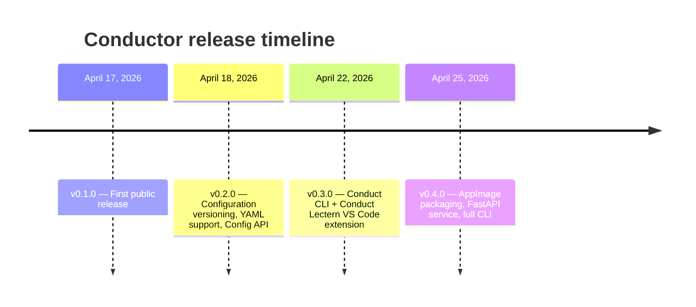

# Release History

```mermaid
timeline
    title Conductor release timeline
    April 17, 2026 : v0.1.0 — First public release
    April 18, 2026 : v0.2.0 — Configuration versioning, YAML support, Config API
    April 22, 2026 : v0.3.0 — Conduct CLI + Conduct Lectern VS Code extension
    April 25, 2026 : v0.4.0 — AppImage packaging, FastAPI service, full CLI
```
